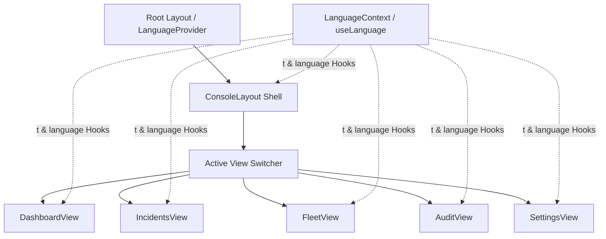

# 코어가드 SOC 콘솔 (CoreGuard SOC Console)

**코어가드 SOC 콘솔**은 자율주행 차량 플릿(로보택시, 셔틀, 배송 포드)의 실시간 보안 모니터링, 센서 무결성 진단 및 비상 대응 제어를 위한 통합 관제 시스템(Security Operations Center) 웹 인터페이스입니다. 

---

## 🏗️ 컴포넌트 아키텍처

본 애플리케이션은 **Next.js** (App Router) 기반으로 설계되었으며, 실시간 다국어 지원(EN/KO)을 위해 글로벌 컨텍스트를 활용합니다.



---

## 🛠️ 주요 기능 모듈

### 1. [관제 레이아웃 (ConsoleLayout)](file:///Users/aleksandr/Desktop/CoreGuard/cgclient/app/components/ConsoleLayout.tsx)
* **Threat Level Badge:** 실시간 위협 수준 수동/자동 상태 조정 (`NORMAL`, `ELEVATED`, `CRITICAL`).
* **Panic Mode Button:** 비상 상황 발생 시 전 차량을 안전 정지 프로토콜(`Safe-Stop`)로 전환하는 전역 패닉 버튼.
* **Language Switcher (EN | KO):** 페이지 새로고침 없이 즉각적인 다국어(영어/한국어) 전환 지원.
* **Precise Clock:** UTC 동기화 방식을 지원하는 정밀 시스템 시계.

### 2. [대시보드 (DashboardView)](file:///Users/aleksandr/Desktop/CoreGuard/cgclient/app/components/views/DashboardView.tsx)
* **보안 KPI 카드:** 플릿 안전 점수(Safety Score), 활성 알림 수, V2X 코어 지연 시간 및 서비스 중인 플릿 비율 표시.
* **실시간 차량 맵 (Geolocator Map):** 서울 강남구 지역 내 자율주행 차량의 위치를 추적하며, 위협 노드 호버 시 상세 팝업 표시.
* **LiDAR Telemetry Framerate:** 12시간 트렌드 분석을 포함한 LiDAR 프레임 레이트 모니터링 차트.

### 3. [인시던트 및 알림 (IncidentsView)](file:///Users/aleksandr/Desktop/CoreGuard/cgclient/app/components/views/IncidentsView.tsx)
* **인시던트 레코드 목록:** 심각도(`CRITICAL`, `HIGH`, `MEDIUM`, `INFO`) 및 처리 상태(`ACTIVE`, `TRIAGED`, `RESOLVED`) 필터링 지원.
* **Raw CAN Bus Analyzer:** 차량 OBD-CAN 인그레스 데이터 패킷 검사 스트림 (예: CAN ID `0x0A2` 브레이크 제어 액추에이터 변조 검사).
* **Safe-Stop Overrides:** 해당 차량에 긴급 제동 신호를 강제 전송하는 물리 제어 옵션.

### 4. [플릿 및 디바이스 (FleetView)](file:///Users/aleksandr/Desktop/CoreGuard/cgclient/app/components/views/FleetView.tsx)
* **센서 스택 자가진단:** 차량 내 LiDAR, Radar, Camera 센서 작동 진단 (`SECURE`, `DEGRADED`, `OFFLINE`).
* **Operational Configurations:** 차량 최대 속도 제한 오버라이드 조절기(Governor) 및 배치 지역 변경 기능.
* **Decommission Button:** 차량 납치 등의 물리적 탈취 시, 차량 내부 HSM 키를 철회하여 보안 연결을 영구 해제하는 폐기 기능.

### 5. [감사 추적 (AuditView)](file:///Users/aleksandr/Desktop/CoreGuard/cgclient/app/components/views/AuditView.tsx)
* **KMS-secured Logs:** 작업자의 조치 및 주요 권한 수정을 기록하는 SHA-256 기반 암호화 로그 목록.
* **KMS Signature Verification:** HSM 키를 이용한 암호화 디지털 서명 무결성 확인 팝업.
* **syslog stream:** 실시간 보안 TLS 로그 전송 데이터 스트림 시뮬레이션.

### 6. [시스템 및 권한 (SettingsView)](file:///Users/aleksandr/Desktop/CoreGuard/cgclient/app/components/views/SettingsView.tsx)
* **RBAC Permission Matrix:** 역할 등급(Admin, Dispatcher, Analyst, Technician)별 긴급 멈춤 권한 가이드맵.
* **Failsafe Policies:** 원격 제어 수신 허용, 비상 시 이중 서명 요구(Double-Signature) 등 전역 보안 가동 장치.
* **API Credentials:** 보안 키 발급 및 폐기 관리 (Ingress/Egress).
* **Telemetry Rules Engine:** 배터리 부족 기준, V2X 지연 시간 경고 한계값 등 경고 발생 기준점 제어.

---

## 🚀 개발 모드 실행 방법

로컬 실행을 하려면 다음 단계를 따르세요:

1. 의존성 패키지 설치:
   ```bash
   npm install
   ```

2. Next.js 개발 서버 구동:
   ```bash
   npm run dev
   ```

3. 브라우저에서 서비스 확인:
   [http://localhost:3000](http://localhost:3000)
